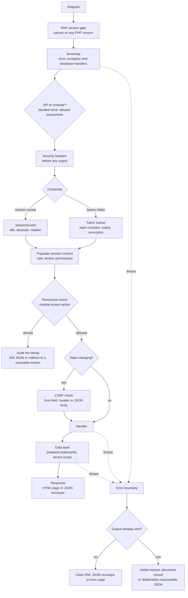
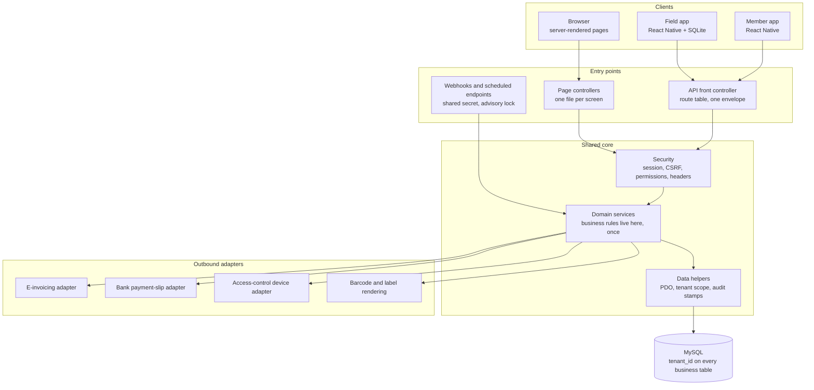
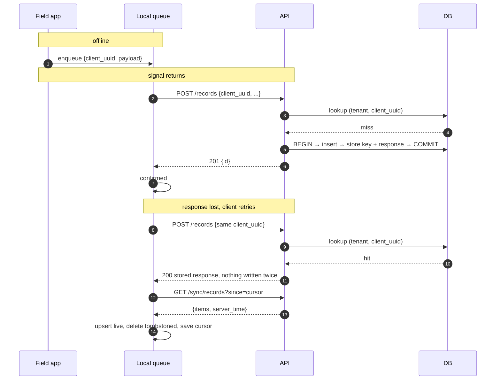

# Engineering an ERP under real constraints


I build and run production business systems for companies that depend on them
daily. That code is theirs and cannot be published. This repository is how I show
the engineering behind it: an architecture case study of two production systems,
written honestly, plus small self-contained reference implementations of the
patterns they are built on — rewritten from scratch, generically, so they can be
read and run.

Nothing here is copied from a client system. No client, product, person, place,
vendor or domain is named. Every code sample in `reference/` was written for this
repository, has no dependencies, passes `php -l`, and is exercised by a test
script you can run in one command.

The two systems:

- **System A — a production ERP for agricultural operations.** Server-rendered
  PHP web application, a REST API, and a React Native field client that works
  with no connectivity. Covers field operations, inventory, purchasing, costing,
  machinery, packing and dispatch, finance and fiscal documents.
- **System B — a multi-tenant membership platform.** Member and dependant
  records, billing through a bank's payment-slip API, an access-control hardware
  integration, and a member-facing mobile app served by a small Node API
  alongside the PHP core.

They share an author, a security core, and a set of constraints. The constraints
are the interesting part, so they come first.

---

## Contents

- [The constraints](#the-constraints)
- [Architecture](#architecture)
- [Engineering themes](#engineering-themes)
  - [1. Session and authentication hardening](#1-session-and-authentication-hardening)
  - [2. Role-based authorisation](#2-role-based-authorisation)
  - [3. Secret storage at rest](#3-secret-storage-at-rest)
  - [4. The data access layer, and why no ORM](#4-the-data-access-layer-and-why-no-orm)
  - [5. Error handling that degrades correctly for two kinds of caller](#5-error-handling-that-degrades-correctly-for-two-kinds-of-caller)
  - [6. Offline-first field capture](#6-offline-first-field-capture)
  - [7. Traceability with standardised barcode identifiers](#7-traceability-with-standardised-barcode-identifiers)
  - [8. A government e-invoicing service](#8-a-government-e-invoicing-service)
  - [9. A bank's payment-slip API, reconciliation and webhooks](#9-a-banks-payment-slip-api-reconciliation-and-webhooks)
  - [10. Multi-tenancy](#10-multi-tenancy)
- [Reference implementations](#reference-implementations)
- [What I would do differently](#what-i-would-do-differently)
- [Repository layout](#repository-layout)

---

## The constraints

Every decision below this line is a consequence of something in this list. Read
the architecture as answers, and these as the questions.

**Managed shared PHP hosting.** Apache with `.htaccess` rewrites and PHP-FPM.
No orchestrator, no service mesh, no sidecars, no platform team. The PHP version
is a host setting outside the application's control and can change without anyone
telling you — so the application enforces its own version floor in a file
deliberately written in syntax old enough to parse on PHP 5, included as the very
first statement of every entry point. Without it, a rollback of the host's PHP
version produces a fatal parse error and a white screen. With it, the operator
gets one sentence naming the problem.

**No Redis, no Memcached, no message broker.** There is nothing to cache in and
nothing to queue in. Session storage is the filesystem. Rate limiting, idempotency
keys, attempt counters, and job coordination all live in the relational database,
because it is the only shared, durable store available.

**No job queue.** Anything that must happen on a schedule is an HTTP endpoint hit
by an external scheduler, guarded by a shared secret and an advisory file lock.
The one background process that does exist — a push-notification sender in System
B — is a hand-rolled loop polling a table. Both work, and both put work in the
wrong place. They are on the list at the bottom of this page.

**Intermittent connectivity in the field.** The people producing the most
valuable data are the furthest from a signal. This is not a performance concern to
be optimised later; it is a correctness requirement that reaches all the way into
the database schema, in the form of idempotency keys and tombstones.

**A very small team.** One to three people, no dedicated QA, no on-call rotation,
no security team. This is the constraint people underrate. It means:
- Clever code is a liability, because in six months there is nobody to explain it
  to and it will be me reading it at 7am.
- Defaults must fail safe, because there is nobody watching a dashboard.
- Errors must be self-diagnosing, because the first responder is the author and
  the second is an accountant.

**Users who cannot be trained away from their working style.** They keep five
tabs open. They fill in a form over twenty minutes and then submit. They lose
signal mid-task. Several of the more interesting decisions in this repository
exist because the textbook implementation broke one of those behaviours.

For scale, and only what I can actually count: the portion of System A this study
was written from is **49 PHP files** (the core includes plus the REST API) and
**86 JavaScript files** (the field client); System B's is **58 PHP files** and
**25 JavaScript files**. That is a count of files in the source directories, and
nothing more — no user counts, no request rates, no uptime figures appear
anywhere in this repository, because I cannot verify them here.

---

## Architecture

### Request lifecycle

Every authenticated request — page or API — passes through the same gates in the
same order. The order is the design: nothing that can fail is allowed to run
before the thing that decides how failures are rendered.



The dotted edges are the point. A failure anywhere lands in one boundary that
already knows what kind of caller is waiting, and that never emits a page which
*looks* complete but is not.

### Layers



Three boundaries carry most of the weight:

**Business rules live in domain services, never in a screen or a route.** A page
controller validates input, calls a service, and renders. An API route validates
input, calls the *same* service, and serialises. When a rule changes it changes in
one place, and the web and the mobile client cannot drift apart — a real risk when
one team member is shipping both.

**The API populates the same session context the web login does.** The mobile
client sends an opaque bearer token; the token lookup resolves the user and tenant
and writes the same session keys the browser login writes. Everything below that
line — services, data helpers, permission checks — works identically for both
entry points, with one tenant-resolution path instead of two. This single decision
is why the API is a thin layer rather than a parallel implementation of the
system.

**Every third-party system sits behind exactly one adapter file.** The core deals
in invoices and payments, not in a vendor's SDK. Replacing a vendor is one file.

### The API layer

A front controller, a route table of `[method, pattern, file, handler, public?]`,
and one envelope:

```json
{ "ok": true, "data": {}, "message": null, "sync": { "server_time": "..." } }
```

- **Error codes are stable identifiers**, not sentences. The client switches on
  `error`, never on `message`, so the message can be rewritten or translated
  without changing client behaviour. The client's retry policy is driven entirely
  by those codes.
- **`server_time` comes from the database clock**, not PHP's. It is the cursor the
  field client stores for delta synchronisation, and it is compared against
  `updated_at` values the database stamped. Two clocks, one authority — see
  [docs/data-layer.md](docs/data-layer.md) for the failure this prevents, which is
  invisible when it happens.
- **CORS is an allow-list**, and a native app sends no `Origin` at all, so it is
  unaffected. The API is bearer-authenticated and stateless, so CORS is hygiene
  rather than a control.
- **The route files cannot be requested directly** — the rewrite sends everything
  to the front controller and a `FilesMatch` rule denies every other PHP file in
  the directory.

### The field client

React Native over SQLite. Screens read from the local database only; the network
is a background process that fills the cache and drains a write queue. Detailed in
[docs/offline-first.md](docs/offline-first.md).

---

## Engineering themes

Each of these states the problem, the decision, the reasoning, and the trade-off
that was accepted. The trade-offs are the honest part.

### 1. Session and authentication hardening

**Problem.** A stolen session id must stop being useful quickly. An operator
filling in a long form must not be logged out. The same user has five tabs open.
The three requirements pull against each other.

**Decision.** Three independent clocks — sliding idle timeout, fixed absolute
timeout, scheduled id rotation — with the garbage collector aligned to the
absolute timeout. Rotation mints a new id but does **not** destroy the old
session; it stamps it and leaves it readable for a short grace window.

**Reasoning.** `session_regenerate_id(true)` deletes the old record immediately.
Requests already in flight from other tabs arrive at an id that no longer exists,
a fresh empty session is created under it, a new CSRF token is minted into it, and
every open form in every other tab is invalidated. The symptom is "it logs me out
randomly", it is hard to reproduce, and it is entirely self-inflicted. Leaving the
old record readable for a grace window makes it disappear.

Separately: the default `session.gc_maxlifetime` is 24 minutes. A policy that
allows 60 minutes of idle time will still see sessions die at roughly 24 unless
the collector is aligned to it — a session policy quietly overruled by a PHP
default nobody set.

**Trade-off.** For the length of the grace window, two session ids are valid for
one user. An attacker holding the pre-rotation id keeps it for those seconds
instead of losing it instantly. That is a bounded, timed risk traded against a
usability failure that is constant and certain.

Also: password hashes are bcrypt cost 12, re-hashed on login when the cost moves;
the login response is uniform in text, status **and timing**, with a dummy verify
on the missing-account path so the endpoint cannot be used to enumerate accounts;
throttling is keyed on (identity, IP) so an attacker cannot lock a legitimate user
out of their own system, with a looser per-IP counter for distributed spraying.

→ [`reference/SessionGuard.php`](reference/SessionGuard.php),
[`reference/LoginThrottle.php`](reference/LoginThrottle.php),
[docs/security-model.md](docs/security-model.md)

### 2. Role-based authorisation

**Problem.** A few dozen screens produce hundreds of permission slugs once view,
edit and delete are separated. Nobody administers that as a list of checkboxes,
and a role defined as an explicit list stops covering new screens the day they
ship.

**Decision.** Hierarchical slugs, `module.screen.action`, with four wildcard
forms: `*`, `module.*`, `module.screen.*`, `*.action`. Resolved once at login into
a flat list on the session; every check is then an in-memory comparison. `module.view`
deliberately does **not** imply `module.screen.view`.

**Reasoning.** A page renders dozens of checks while deciding which buttons to
draw; a database round trip per check is not viable. Wildcards make roles
maintainable by a human and keep them correct as screens are added. Separating
"see the module in the menu" from "see the data on its screens" prevents a
navigation grant from quietly handing over everything beneath it.

**Trade-off.** Two of them, both real.

*Wildcards grant permissions that do not exist yet.* That is the point, and the
risk. The mitigation is that genuinely sensitive actions — approving, reopening,
writing off — get slugs outside the wildcard namespace, so they must be granted
explicitly and appear in an audit of who holds them.

*Permissions are snapshotted at login,* so a revocation takes effect at the user's
next login rather than immediately. Re-checking per request would fix it and cost
a query per check. The middle path — a role version that invalidates the snapshot
— is not implemented, and "revocation applies at next login" is the accurate
description of what ships.

→ [`reference/Permissions.php`](reference/Permissions.php),
[docs/security-model.md](docs/security-model.md)

### 3. Secret storage at rest

**Problem.** Third-party credentials the system must *use*, not merely check: an
OAuth client secret, a certificate passphrase, a device password. They cannot be
hashed. A database dump must not be a set of working credentials for someone
else's bank API.

**Decision.** AES-256-GCM under a key derived per purpose from a master key held
in the process environment. The ciphertext carries a **key id**, so rotation is a
background sweep instead of a big-bang migration. Tenant and purpose are
authenticated as associated data. Secrets are masked in the UI and the save path
is mask-aware, so re-saving a form cannot overwrite a credential with asterisks.

**Reasoning.** GCM authenticates as well as encrypts — a modified ciphertext fails
to open rather than decrypting to garbage that something downstream then parses.
Per-purpose derived keys mean compromise of one does not unlock the others. The
key id is the entire rotation story: add the new key, mark it current, sweep old
rows at leisure, and only then retire the old key. Binding the tenant as
associated data means a ciphertext copied between rows fails to open, so a
row-level swap is detected rather than honoured.

The strongest variant of this decision was not to encrypt at all: the fiscal
certificate passphrase lives in a gitignored file on disk and is never written to
a column. A dump then contains nothing to decrypt.

**Trade-off.** The master key sits in the process environment. Anyone who can read
that environment can decrypt everything. On this hosting there is no key
management service to delegate to, so the honest claim is "this raises the cost of
a database leak" and not "this protects the secrets from a host compromise". I
would rather write that sentence than imply a guarantee the deployment cannot
make.

→ [`reference/SecretBox.php`](reference/SecretBox.php)

### 4. The data access layer, and why no ORM

**Problem.** Tenant scoping and audit stamping must be right on every write, and
the reporting queries are genuinely complex. On this hosting an ORM brings a
migration runner, a metadata cache and a query builder — three pieces of
infrastructure that assume an environment that does not exist here.

**Decision.** PDO with native prepares, plus helpers that make the safe form the
short form: `insert()` stamps `tenant_id` and the acting user; `update()` and
`delete()` put the tenant in the `WHERE`; `delete()` inactivates when the table
supports it and translates a foreign-key violation into a sentence a user can act
on.

**Reasoning.** A developer cannot forget the tenant on a write, because there is
no parameter to forget. Reporting SQL stays readable and tunable. Native prepares
mean a value can never be re-parsed as syntax — at the cost of a rule the codebase
must remember: a named placeholder may appear only once per statement, and clauses
like `LIMIT` and `INTERVAL` cannot be parameterised at all. Both consequences are
documented at the site of every exception.

**Trade-off.** Repetition. Similar `SELECT` clauses appear on more than one screen
and a schema change means grepping. And reads are only *conventionally* scoped —
nothing structurally prevents the next hand-written `SELECT` from omitting the
tenant predicate, which is the most dangerous gap in the system and is discussed
without softening in [docs/multi-tenancy.md](docs/multi-tenancy.md).

→ [`reference/Database.php`](reference/Database.php),
[docs/data-layer.md](docs/data-layer.md)

### 5. Error handling that degrades correctly for two kinds of caller

**Problem.** The same process answers a browser navigation, an in-page fetch, and
a native mobile client. Default PHP behaviour is wrong for all three: a stack
trace leaks internals, a blank page tells the user nothing, and an empty body
makes the mobile client report a network error and retry — turning one fault into
a retry storm.

And the worst case: a failure *after* rendering has begun produces a page that
looks finished but is missing half its content. That is the only one of the three
that nobody notices.

**Decision.** One boundary, installed before anything can fail. Warnings become
exceptions. Content negotiation happens once, up front, and every failure path
obeys it — including the shutdown handler, which is the one people forget and the
one that fires for a memory exhaustion. A failure before output produces a clean
500 in the right format. A failure after output *declares itself*: a visible
banner and a closed document for a browser; a deliberately unparseable trailer for
a JSON caller, so its decoder fails and its error path runs instead of it treating
truncated data as complete. The user gets an opaque message with a correlation id;
the log gets everything.

**Reasoning.** Nothing can un-send bytes already flushed, so the only honest
options are "declare it" or "hide it", and hiding it means silently wrong data on
screen. A correlation id printed to both audiences is what makes a support call
resolvable without a reproduction. Output buffering is the cheaper half of the fix
where the memory cost is acceptable — it lets a partial page be discarded entirely.

**Trade-off.** Promoting every warning to an exception makes a legacy codebase
strict all at once, and pages that previously "worked" start dying on undefined
array keys. That is the intent, but it is a migration with a cost, and it belongs
behind a per-environment switch rather than being flipped on a Friday.

→ [`reference/ErrorBoundary.php`](reference/ErrorBoundary.php)

### 6. Offline-first field capture

**Problem.** The record of what was applied, where, by whom, and when is the input
to inventory, costing and traceability. It is captured standing in a field, often
with no signal. "Retry on failure" is not a solution.

**Decision.** A local SQLite database with a read cache per module and a write
queue with an explicit state machine. Every record gets a **client-generated
UUID** at creation, and every write endpoint is idempotent on it: the server
stores `(tenant, client_uuid) → (resource_id, response)` behind a unique
constraint, and a replay returns the stored response byte-for-byte.

Failures are classified into three kinds with three behaviours: no connectivity
returns the item to the queue and *stops the drain*; a transient server fault
enters exponential backoff to a cap; a business rejection is marked failed
immediately and never retried. Reads are delta-synchronised on a database-clock
cursor, with tombstones for rows that leave the working set and whole-snapshot
replacement for modules that are views rather than accumulating sets.

**Reasoning.** Idempotency is what makes retrying safe, and safe retrying is what
makes everything else possible — without it, every ambiguous failure forces a
choice between losing a record and duplicating one. Classifying failures is what
stops the two classic bugs: looping forever against a server that will never
accept the record, and discarding a record the operator cannot recreate. Items
stuck in `sending` after a crash are re-hydrated to `pending` on launch, which is
only safe *because* of idempotency.

**Trade-off.** The client necessarily contains presentation logic so it can render
every screen from cache, so some duplication between server and client is
unavoidable. Conflicts are resolved by policy — last write wins, except where the
server can see the office already acted, in which case the field write is rejected
as a business conflict and surfaced to the operator. No CRDT, no three-way merge:
for this domain "the office decided, tell the operator" is both correct and
explainable to a user.



→ [docs/offline-first.md](docs/offline-first.md)

### 7. Traceability with standardised barcode identifiers

**Problem.** A carton of fresh produce must carry a label that a buyer's scanner —
not yours — can read, identifying the item, the net weight and the batch. If a
problem is found downstream, the batch is what turns "recall everything" into
"recall these pallets".

**Decision.** GS1 Application Identifiers encoded as a Code 128 element string
with the FNC1 start character: trade item number, net weight, batch. Rendered as
inline SVG on the server, with no network call. Human-readable text always printed
alongside the bars.

**Reasoning.** An internal sequence number stops meaning anything the moment the
box leaves the building. The details are where this succeeds or fails: the
variable-length batch field goes last so no separator is needed; weight is an
integer number of grams zero-padded to the fixed width, and a value that does not
fit is rejected rather than truncated, because a truncated weight scans perfectly
and is wrong; the trade item check digit is verified at label generation, not
discovered at a customer's receiving dock. SVG because a resampled raster barcode
is a barcode that intermittently fails to scan — the worst failure mode there is,
since it works in testing. No network call because a packing house does not stop
when the internet does, and because a batch code is commercially sensitive.

**Trade-off.** Implementing a subset of a large standard by hand means the subset
is understood and dependency-free, and that anything outside it is a code change
rather than a configuration change. Right for a fixed set of carton types; wrong
for a business needing arbitrary AI combinations, where a maintained library is
the correct answer.

→ [docs/traceability.md](docs/traceability.md)

### 8. A government e-invoicing service

**Problem.** Signed XML, a certificate that belongs to the business and expires
annually, a schema versioned by the authority, and a test environment whose
confusion with production has legal consequences.

**Decision.** One adapter file knows the library exists. The certificate lives
outside the web root and its passphrase in a gitignored config file, never in the
database. The ambiguous or missing configuration case defaults to the **test**
environment. Incomplete configuration produces a *checklist* — "missing: tax id,
certificate passphrase" — not an exception. The first call the integration ever
makes is a service-status probe.

**Reasoning.** A default that fails safe beats a default that is convenient when
the failure mode is issuing real fiscal documents by accident. The checklist
matters because the person who can fix the problem is an accountant, and "missing
certificate passphrase" is actionable while a stack trace is not. The status probe
proves the certificate loads, the passphrase is right, the network path works and
the authority is up — in one call, without creating a document. Responses are
parsed by local element name rather than by namespace-qualified path, because
government XML namespaces vary between endpoints and change between revisions.

**Trade-off.** Tolerating incomplete configuration means the system can sit for
weeks in a state where fiscal issuance silently does not work. The surfacing is a
screen the user must visit, not an alert that finds them. Without a job queue or a
notification channel, that is what is available — and it is a gap, not a feature.

→ [docs/integrations.md](docs/integrations.md)

### 9. A bank's payment-slip API, reconciliation and webhooks

**Problem.** Issuing a slip is synchronous. *Payment* is an event that happens
hours or days later, at a counter or in an app, and reaches you — maybe — through
a webhook you do not control and cannot replay.

**Decision.** OAuth 2 client credentials plus a client certificate, with both
secrets — the client secret and the certificate passphrase — encrypted at rest and
the active environment (sandbox or production) stored explicitly per tenant.
Payment state is discovered through **three** paths, and the system is correct when
they arrive in any order: a webhook, an operator's on-screen query, and a
scheduled sweep over open slips.

All three converge on one reconciliation service, and that service applies a
payment only from the bank's answer to a query it made itself. The webhook does
not write to the ledger: it authenticates, resolves the tenant, and hands the
payload to that same service. Applying a payment is one transaction — update,
status history, audit entry — and applying it to an already-paid slip is a
reported no-op, not an error and not a second entry. Amount divergences are
flagged for a human rather than resolved automatically.

**Reasoning.** Treating the webhook as a hint rather than as truth removes an
entire class of attack and bug at once: a spoofed, replayed or duplicated webhook
cannot post a payment, because payments are only ever recorded from a query the
system itself made. The sweep exists because webhooks get lost, and a financial
system that discovers payments only when the network cooperates is not a
financial system. All three paths regularly find the same payment, which is
exactly why the write has to be idempotent.

The unauthenticated endpoints — webhook and scheduler — carry their own controls:
a shared secret compared with a timing-safe comparison and read from the
environment, an explicitly resolved and validated tenant, writes attributed to a
dedicated technical user so the audit trail distinguishes "the bank told us" from
"an operator did this", and an advisory file lock per tenant so a slow bank does
not produce overlapping sweeps racing each other.

**Trade-off.** With no job queue, the sweep is an HTTP endpoint on a request
thread. It is idempotent, locked and batch-limited, and it is still long-running
work in the wrong place; a slow bank pushes it toward a timeout. A worker process
consuming a queue is the right answer and is not available on this hosting.

→ [docs/integrations.md](docs/integrations.md)

### 10. Multi-tenancy

**Problem.** One deployment, many customer organisations, and a class of bug —
one organisation reading another's data — that would end the product.

**Decision.** Shared schema, `tenant_id` on every business table, and the tenant
resolved from exactly one place: the authenticated session. Never from a
parameter, a header, or a URL segment. The API's bearer-token lookup populates the
same session shape as the web login, so there is one tenant-resolution path for
both.

**Reasoning.** A database or schema per tenant gives stronger isolation and was
rejected on migrations: applied by hand, with no runner and no transactional DDL,
N schemas is N careful operations that must all succeed. Isolation bought with a
deployment procedure guaranteed to drift is not isolation. And the moment a tenant
id can be *supplied* by a caller, every endpoint that accepts one is a missing
check away from cross-tenant access; deriving it from the session means there is
nothing to check because there is nothing to supply.

**Trade-off.** Writes are structurally scoped; **reads are only conventionally
scoped**. A hand-written `SELECT` can omit the predicate, and when it does it
fails silently — the query works and returns another organisation's rows. Every
read path filters correctly today; nothing prevents the next one from not doing
so. A test that greps every `SELECT` for a tenant predicate would close most of
the gap and costs an afternoon. It is not written, and that is a fair criticism.

Beyond that: one connection pool, one process pool, one uploads directory, one
session directory. Nothing architectural mitigates the noisy-neighbour problem —
only the fact that the tenants are of comparable size, which is a mitigation with
an expiry date.

→ [docs/multi-tenancy.md](docs/multi-tenancy.md)

---

## Reference implementations

Self-contained PHP 8.1+ files, written for this repository. No Composer, no
framework, no external services. Each carries a docblock explaining the decision
and the trade-off, and each runs standalone as a small demonstration.

| File | Pattern |
|---|---|
| [`SessionGuard.php`](reference/SessionGuard.php) | Idle and absolute timeouts, cookie flags, and id rotation that leaves in-flight requests on other tabs working |
| [`LoginThrottle.php`](reference/LoginThrottle.php) | Per-identity and per-IP throttling, fail-closed, with a constant-time dummy hash so a missing account costs the same as a wrong password |
| [`SecretBox.php`](reference/SecretBox.php) | AES-256-GCM at rest, HKDF-derived per-purpose keys, context as associated data, and a key-id rotation path |
| [`Permissions.php`](reference/Permissions.php) | Hierarchical permission slugs with four wildcard forms |
| [`SecurityHeaders.php`](reference/SecurityHeaders.php) | The response headers, why each is set, and an honest CSP migration path |
| [`ErrorBoundary.php`](reference/ErrorBoundary.php) | One failure path for HTML and JSON callers, including the mid-render case |
| [`Database.php`](reference/Database.php) | A PDO factory, and what disabling emulated prepares actually costs you |

Run anything on its own:

```
php reference/SecretBox.php
php reference/Permissions.php
```

Run the suite:

```
php reference/tests/run.php
```

It is a dependency-free runner — a framework would undercut the point that these
files have no dependencies — and it exits non-zero on failure. It asserts real
behaviour, not shapes: that a tampered ciphertext is refused, that an envelope
encrypted under a retired key still decrypts while that key is in the ring and is
flagged for rotation, that a rotated-away session id stops working after the grace
window but not during it, that a spraying IP is blocked while the sprayed accounts
are not locked out, that the unknown-account and wrong-password paths cost the
same order of work, that a mid-render failure never emits a second `<!doctype>`,
and that a broken attempt store fails closed.

---

## What I would do differently

Not a list of polite regrets. These are the things that would come up in a real
review of the real systems, in the order I would fix them.

**1. No migration runner.** Migrations are numbered SQL files applied by hand.
There is no `schema_migrations` table and therefore no reliable answer to "which
migrations has this environment had". The code compensates by asking
`information_schema` whether a column exists and assembling queries to match — so
an environment one migration behind degrades instead of throwing. That compromise
keeps a partially migrated system usable, and it also means the schema is not a
contract, drift persists unnoticed, and every conditional column is a branch no
test covers. This is the root cause of more incidental complexity than anything
else on this list, and it is fixable in a day with a version table and a fifty-line
runner.

**2. Tenant scoping on reads is convention, not structure.** Writes cannot omit
the tenant — the helpers put it there. Reads can, because a hand-written `SELECT`
is just a string. Every read path filters correctly today; nothing prevents the
next one from not doing so, and a missing predicate fails *silently*, returning
another organisation's rows to a screen that renders them without complaint. For
a multi-tenant product this is the highest-consequence gap in the system, and the
cheapest partial fix — a test that greps every `SELECT` for a tenant predicate and
fails the build on an unannotated exception — is an afternoon's work. It is not
written.

**3. No automated test suite.** Not "thin coverage" — none. Every change is
verified by hand. For a system that computes costs and issues fiscal documents,
that is the largest single risk, and it is embarrassing to write down. The reason
is real (an afternoon spent on tests is an afternoon not spent on a feature a
client is waiting for) and it stops being a reason at exactly the point where the
system has enough rules to be worth trusting. The reference implementations in
this repository ship with tests because that is what the production code should
have had. The first tests to write are not unit tests: they are a permission
matrix, a tenant-scope grep over every `SELECT`, and an idempotency replay test.

**4. No job queue.** Scheduled work is an HTTP endpoint hit by an external
scheduler, guarded by a token and an advisory file lock, so bank reconciliation
runs on a request thread. The lock stops overlapping runs and the batching stops
runaway execution, but a slow third party still pushes a request toward a timeout.
The one real background process — the push-notification sender — is a loop that
polls a table, sends, and marks rows done; a send that fails is simply retried on
the next cycle, for ever, with no backoff, no attempt cap, no dead-letter
visibility and no way to see depth. That is the shape of a queue drawn by hand
with all the hard parts left out. A database-backed queue table with those parts
present, consumed by the same style of worker, would be strictly better and is not
a large piece of work.

**5. A global `$pdo` alongside a connection singleton.** The connection file
defines a singleton *and* assigns a module-level `$pdo` that older code reaches
for with `global $pdo`. Two ways to get the same object, one of them invisible in
a function's signature. It is the clearest evidence of an unfinished migration
between two eras of the codebase, and it makes the dependency graph unreadable
exactly where it matters most. Injecting the connection is the fix; it is
mechanical and it is not done.

**6. No application cache layer.** Every page hits the database for everything,
including permission catalogues and configuration that change monthly at most.
There is no Redis on the host, which is a reason not to have a distributed cache —
not a reason to have no cache at all. A short-lived in-request memoisation of the
things that are read repeatedly would cost almost nothing.

**7. Sessions on the filesystem.** Fine on one host; it silently constrains the
system to one host. Any horizontal scaling requires either sticky sessions or a
shared session store, and that is a decision deferred rather than made. A database
session handler would remove the constraint using infrastructure that already
exists.

**8. Uploads handled per screen instead of through one service.** Each screen
implements its own extension allow-list, size limit, destination path and naming.
A shared content-sniffing check was added as a second layer precisely because the
per-screen checks were not uniform — which is the symptom, not the cure. One
upload service with one policy, one storage abstraction and one set of tests would
replace a dozen near-identical blocks and remove a class of bug where a new screen
is one forgotten check away from storing an executable.

**9. Fallback authorisation in code as well as in data.** When a tenant's role
tables have not been populated, a hard-coded map of role name to permissions takes
over. It keeps a new tenant usable on day one, and it means two places can answer
"what may this role do" and can disagree. It should be a seed migration.

**10. Business logic in one very large service file, with almost no transactions.**
The domain services are the right *idea* — rules in one layer, called by both the
web and the API — and the implementation grew into a single file large enough that
navigating it is a grep-first activity. Reading it turned up something worse than
size: dozens of service functions, and almost none of them open a transaction. The
API's idempotency helper wraps its write properly, and the payment reconciliation
path does, but a multi-step domain write — deduct stock, record the movement,
update the parent record — can be interrupted between statements and leave the
data inconsistent, with no error anywhere. Splitting the file by domain is
cosmetic next to auditing every multi-statement write for atomicity.

**11. The CSP is transitional and should be finished.** It still allows inline
script, which means it stops very little. The path is known and written down —
self-host assets, add per-response nonces, convert inline handlers to listeners,
enforce. Step three is the expensive one and it is the one that matters. Shipping
a report-only policy and calling the application "protected by CSP" would be a
lie; leaving it half-done indefinitely is only slightly better.

---

## Repository layout

```
README.md                    this case study
NOTES.md                     which claims were verified against the source, and how
LICENSE                      MIT
docs/
  security-model.md          threat model, sessions, CSRF, authorisation, secrets
  data-layer.md              why no ORM, native prepares, schema evolution
  offline-first.md           local queue, idempotency, delta sync, failure classes
  traceability.md            GS1 element strings, check digits, label rendering
  integrations.md            e-invoicing, bank payment slips, access-control hardware
  multi-tenancy.md           shared schema, tenant resolution, where it is weakest
reference/
  SessionGuard.php
  LoginThrottle.php
  SecretBox.php
  Permissions.php
  SecurityHeaders.php
  ErrorBoundary.php
  Database.php
  tests/run.php              dependency-free test runner, exits non-zero on failure
```

`NOTES.md` records which statements in this README were checked against the
production source and how, so they can be re-checked. Anything I could not verify
is not in this document.

## Licence

MIT — see [LICENSE](LICENSE). The reference implementations are yours to take.
