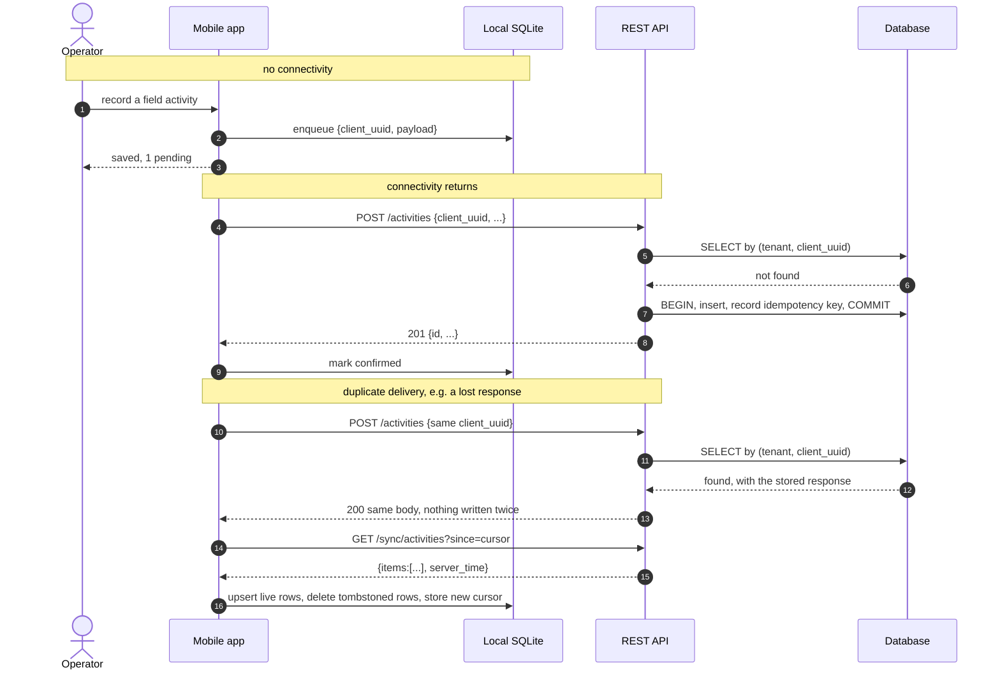

# Offline-first field capture

## The constraint

The people entering the most valuable data are the furthest from connectivity.
A field operator records what was applied, to which block, by whom, at what time.
That record is the input to inventory, to cost accounting, and to the traceability
paperwork. It has to be captured at the moment it happens, standing in a field,
frequently with no usable signal.

"Retry when the request fails" is not offline-first. Offline-first means the
application is fully usable with the network permanently off, and synchronisation
is a background concern the operator never has to think about.

## The shape of the solution

A local SQLite database on the device with two responsibilities:

- **A read cache**, one bucket per module, holding the working set the screens
  read from. Screens read *only* from the cache. They never wait on the network,
  which also means there is exactly one rendering path instead of an online one
  and an offline one.
- **A write queue**, one row per pending operation, with a state machine:
  `pending → sending → confirmed | retrying | failed`.

Reads and writes are independent. Losing signal mid-session degrades nothing:
screens keep rendering from cache and new records keep landing in the queue.

## Writes: idempotency is the whole design

Every record created offline is assigned a UUID **on the device, at creation
time**. That id travels with the payload, and the server's write endpoints are
idempotent on it.

Server-side, in one transaction: look up the client UUID in an idempotency table;
if present, return the stored response; if not, perform the write and record
`(tenant, client_uuid) → (resource_id, response_json)`. A unique constraint on
that pair is the actual guarantee — two concurrent replays race, one wins, the
loser catches the constraint violation and returns the row the winner wrote.

This is what makes retrying safe, and retrying safely is what makes the rest of
the design possible. Without it, every ambiguous failure (request sent, response
lost) forces a choice between losing a record and duplicating one. With it, the
client can retry as often as it likes and the answer is always the same.

The second-order benefit: the *response* is stored, not just the id. A replay
returns byte-for-byte what the first attempt returned, so the client's success
path is identical whether it is the first delivery or the fifth.

## Failure classification

The most important thing the sync engine does is distinguish three kinds of
failure, because they need three different behaviours:

| Kind | Example | Behaviour |
|---|---|---|
| No connectivity | request never left the device | Return the item to `pending`, **stop the queue** |
| Transient server fault | 500, timeout, gateway error | Exponential backoff, retry, give up after a cap |
| Business rejection | validation failed, permission denied, period closed | Mark `failed` **immediately**, never retry |

Collapsing these is the classic mistake. Retrying a business rejection loops
forever against a server that will never say yes. Treating a lost connection as a
permanent failure throws away a record the operator cannot recreate. And
continuing to drain the queue after the first connectivity failure just burns
battery on requests that will all fail identically — hence the explicit "stop the
queue" rather than "continue to the next item".

The server makes this classification possible by returning **stable error codes**
alongside human-readable messages. The client switches on the code, never on the
text. That contract is what lets the message be rewritten, translated, or
improved without changing client behaviour.

Two details that came out of real use:

- **Items stuck in `sending` are re-hydrated at app start.** A crash between
  "send" and "record the response" leaves an item in a state nothing will ever
  move it out of. On launch, anything `sending` goes back to `pending`.
  Idempotency makes that safe by construction.
- **Definitively rejected items are surfaced, not silently dropped.** A visible
  count of "records the server refused" with the reason, and a way to discard or
  edit-and-resend. A queue that quietly eats records is worse than no queue,
  because it looks like it worked.

## Reads: delta synchronisation

Each module is fetched with a cursor: `GET /sync/{module}?since=<timestamp>`. The
server returns rows whose `updated_at` is newer than the cursor, capped and
ordered, and echoes its own `server_time`, which becomes the next cursor.

Four details that matter more than the basic idea:

**The cursor comes from the database clock, not the application clock.** See
[data-layer.md](data-layer.md) — a cursor taken from a clock running ahead of the
database's silently hides every record written in the gap.

**A cursor from the future triggers a full reload.** If the stored cursor is
later than the server time in the response, the client discards it and re-runs
the initial load. This turns an invisible data-loss bug into a slow sync.

**Deletions need tombstones.** A delta feed only ever describes rows that exist.
A row that left the working set — cancelled, deactivated, moved out of a status
filter — is invisible to the delta, so it lives in the device cache forever. The
delta therefore includes those rows with a deletion marker, and the client
removes them. (Physical `DELETE` is not covered by this and is not the pattern
used; records are deactivated.)

**Some modules are snapshots, not deltas.** "Open tasks assigned to me" is a
*view*, not an accumulating set: an item leaves it when someone else picks it up.
Expressing that as a delta requires tombstones for every possible exit condition.
It is simpler and more robust to declare such modules snapshot-shaped, fetch the
whole current view, and replace the local bucket wholesale. Small sets only —
this trades bandwidth for correctness, and only where the set is bounded.

## Attachments

Photos are queued as separate items with a parent reference to the record they
belong to, and the queue orders parents before children. The upload posts the
parent's client UUID rather than a server id, so the server resolves the link —
which means a photo can be queued before its parent has ever been delivered, and
the two can be sent in the same drain without any client-side id bookkeeping.

## What this costs

- **The mobile client contains business logic.** Not the rules — those stay on
  the server — but enough presentation logic to render every screen from cache.
  Some duplication between server and client is unavoidable.
- **Conflicts are resolved by policy, not by merge.** Last write wins, except
  where the server can detect that the office already acted on a record, in which
  case the field's write is rejected as a business conflict and surfaced to the
  operator. There is no CRDT and no three-way merge; for this domain, "the office
  decided, tell the operator" is the correct behaviour and far easier to explain
  to a user than an automatic merge.
- **Schema changes have to be backward compatible for a while.** Devices in the
  field may go weeks without an update. Adding fields is safe; removing or
  renaming them is not.

## Sequence

